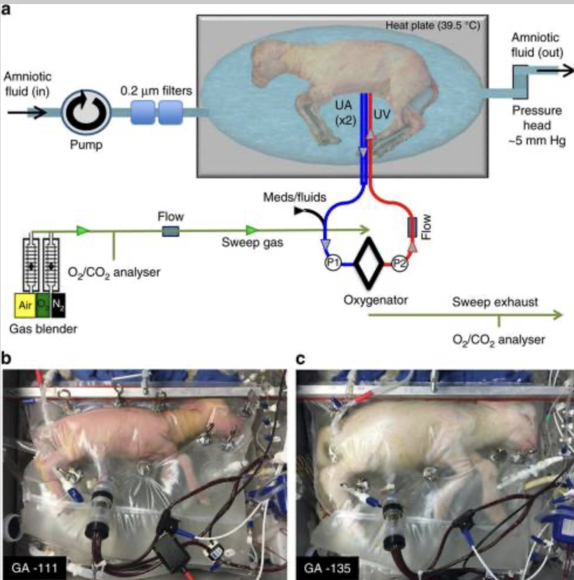

# Artificial Womb Timeline

Welcome, this project traces the evolution of ectogenesis exemplified in iterations of the artificial womb

## Timeline Navigation

- [Vitalism to Mechanism](#1920s-40s)
- [Cybernetics and Control](#1940s-60s)
- [Feminist Critique](#1970s-90s)
- [Speculative Futures](#2000s-now)

## Timeline sections
- **1920s–1940s**: Vitalism to Mechanism  
- **1940s–60s**: Cybernetics and Information Theory  
- **1970s–90s**: Feminist Reproductive Critique  
- **2000s–Now**: Speculative Technologies and Ethics

## 1920s–1940s: Vitalism to Mechanism

## 1940s-60s: Cybernetics and Information Theory 

## 1970s-90s: Feminist Critique

## 2000s-now: Speculative Technologies and Ethics

<h3>Images or visualizations</h3>

  
   
  <em>The Biobag used in fetal lamb experiments, 2017 (Partridge et al.)</em>

